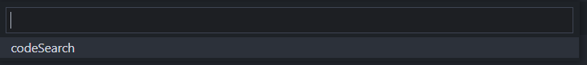
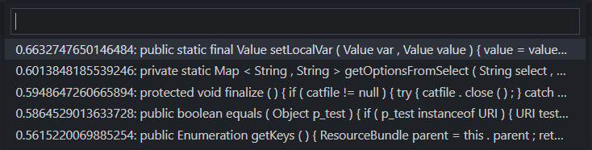
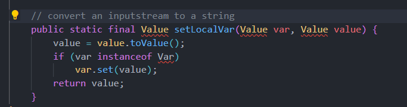

# codesearcher README

This is a vscode plugin to demonstrate ncc models

## Features

- press ctrl+1 to activate QuickPick to pick a function
	- When your cursor is on a comment line like `//do some thing` and choose function `codeSearch`, it will read the comment and then query it to get some code snippets with possibilities, you can choose one that fits your need .

## Usage

For example of use the plugin, there are some illustrations:

## Requirements

- If you want to **compile and run the plugin code**, you may need the dependencies listed in `./package.json`

- If you want to run the **server**, you may need the python dependencies listed in `../../requirements.txt`

## Extension Settings

This extension contributes the following settings:

* `codesearcher.queryDomain`: set the domain where the model server is.
* `codesearcher.queryPort`: set the port which the model server is listening to.

## Known Issues

- the `codeSearch` function only support line comment.
- the model now only support java lang.
- the accuracy may be low.

## Release Notes

### 0.0.1

Base plugin with function codeSearch using deepcs model server.

## License

This subproject is under MIT license.
